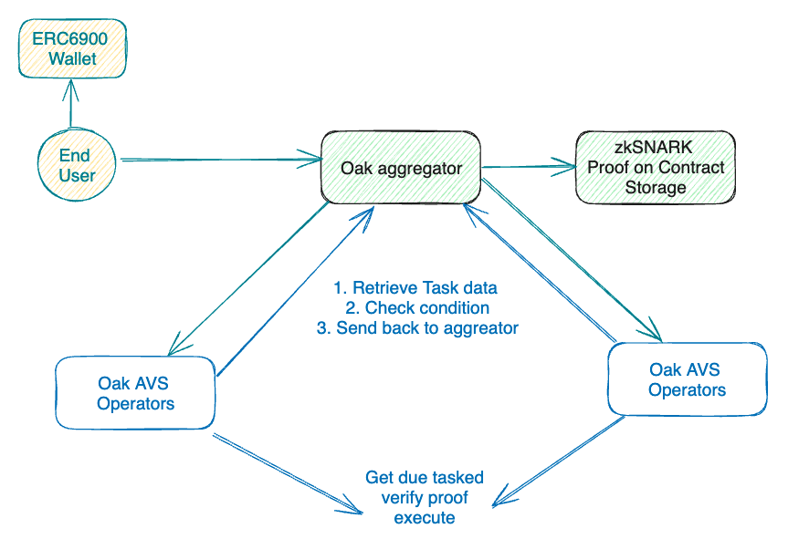

# Ava Protocol Automation On Ethereum

The Ava Protocol AVS can be compiled directly using Go version 1.22+. Ensure you have the appropriate version of Go installed on your development environment.

Check Go version:

```
go version
```

Compile Ava Protocol AVS:

```
go build -o ap-avs
```

Then you can run `ap-avs` binary. We make an effort to use pure Go so you can also cross compile for any supported architecture that the Go compiler support.

## Run operator

Check how to run an [operator docs](docs/operator.md)


### Run aggregator

To run the aggregator, use the following command:

```
ap-avs aggregator
```

Note: The Ava Protocol team currently manages the aggregator, and the communication IP address between the operator and the aggregator is hardcoded in the operator.

# How it works

<table><tr><td bgcolor='white'></td></tr></table>


## User wallet

For each owner we deploy a ERC6900 wallet to schedule task and approve spending
to user wallet.

Each task type has their equivalent modular code to re-present their condition
and their actual execution.

## Aggregator

Aggregator accepts RPC request from client to submit Task Payload. Currently, aggregator is managed and run by Ava Protocol team.

Periodically, aggregator combine the task submission, update our internal
storage and a zkSNARK proof will be write back to our TaskManager contract.

Aggregator also accept task condition check result from operator, perform quorum
and consensus check, then write the result back and flag that a task is good to
run.

### Aggregator Address

The aggregator is currently run and managed by the Ava Protocol team. Depend on
testnet or mainnet, you would need to point your operator to the right address
in the operator config file.

#### Holesky Testnet

- aggregator-holesky.avaprotocol.org:2206

#### Mainnet

- aggregator.avaprotocol.org:2206


## Operators

Operators communicates with aggregators through RPC. It requests task data from aggregator, it performs condition execution to check whether a task can be trigger. The result is then send back to aggregator.

For task is ok to run, the operator will executed them. The detail of how task
is triggering through our ERC6900 modular wallet will come soon.

## Ava Protocol operator address

Currently, Ava Protocol has deployed our operator on the testnet. Community members can run their own operator and register for Ava Protocol AVS service, or they can delegate their tokens to the Ava Protocol operator.

### Testnet

- Ava Protocol's operator: [0x997e5d40a32c44a3d93e59fc55c4fd20b7d2d49d](https://holesky.eigenlayer.xyz/operator/0x997e5d40a32c44a3d93e59fc55c4fd20b7d2d49d). 

### Mainnet

- Ava Protocol's operator: [0xc6B87cc9e85b07365b6aBEfff061F237F7cf7Dc3](https://etherscan.io/address/0xc6B87cc9e85b07365b6aBEfff061F237F7cf7Dc3)

## Telemetry Dashboard

Operator that is connected to Ava Protocol aggregator can also check their
operator on our telemetry dashboard as below

### Testnet

https://aggregator-holesky.avaprotocol.org/telemetry

### Mainnet

https://aggregator.avaprotocol.org/telemetry

# Development guide

View docs/development.md

## Dependencies

### EigenLayer CLI

Install the EigenLayer CLI with the following command:

```
curl -sSfL https://raw.githubusercontent.com/layr-labs/eigenlayer-cli/master/scripts/install.sh | sh -s
```

### Golang

Install Go with the following command:

```
brew install go
```

### Foundry Toolchain

Install the Foundry toolchain with the following commands:

```
curl -L https://foundry.paradigm.xyz | bash
foundryup
```
### Protobuf Compiler

```
go install google.golang.org/protobuf/cmd/protoc-gen-go@latest
```

## Getting started

Coming soon

## Contract address

### Holesky Testnet

| Name                     | Address                                                                                                                 		|
| ------------------------ | -------------------------------------------------------------------------------------------------------------------------------	|
| ProxyAdmin              | [`0x26CF7A7DF7d1E00D83A5Ca24385f697a3ca4577d`](https://holesky.etherscan.io/address/0x26CF7A7DF7d1E00D83A5Ca24385f697a3ca4577d) 	|
| ServiceManager          | [`0xEA3E82F9Ae371A6a372A6DCffB1a9bD17e0608eF`](https://holesky.etherscan.io/address/0xEA3E82F9Ae371A6a372A6DCffB1a9bD17e0608eF) 	|
| RegistryCoordinator     | [`0x90c6d6f2A78d5Ce22AB8631Ddb142C03AC87De7a`](https://holesky.etherscan.io/address/0x90c6d6f2A78d5Ce22AB8631Ddb142C03AC87De7a) 	|
| BLSApkRegistry          | [`0x6752F8BeeE5BF45c9d11FDBC4F8aFfF879925585`](https://holesky.etherscan.io/address/0x6752F8BeeE5BF45c9d11FDBC4F8aFfF879925585) 	|
| IndexRegistry           | [`0x298a5d3C8F8Db30E8292C9e2BF92292de469C8FF`](https://holesky.etherscan.io/address/0x298a5d3C8F8Db30E8292C9e2BF92292de469C8FF) 	|
| OperatorStateRetriever  | [`0xb7bb920538e038DFFEfcB55caBf713652ED2031F`](https://holesky.etherscan.io/address/0xb7bb920538e038DFFEfcB55caBf713652ED2031F) 	|
| PauserRegistry          | [`0x3A8ea6e4202CdDe4a9e0cCE19c4Dc1739ba2cF0b`](https://holesky.etherscan.io/address/0x3A8ea6e4202CdDe4a9e0cCE19c4Dc1739ba2cF0b) 	|
| StakeRegistry           | [`0x7BacD5dd5A7C3acf8bf1a3c88fB0D00B68EE626A`](https://holesky.etherscan.io/address/0x7BacD5dd5A7C3acf8bf1a3c88fB0D00B68EE626A) 	|


### Ethereum Mainnet

| Name                     | Address                                                                                                                 		|
| ------------------------ | -------------------------------------------------------------------------------------------------------------------------------	|
| ProxyAdmin              | [`0x5989934D31f7f397511f105B7E4175a06B7A517F`](https://etherscan.io/address/0x5989934D31f7f397511f105B7E4175a06B7A517F) 	|
| ServiceManager          | [`0x18343Aa10e3D2F3A861e5649627324aEAD987Adf`](https://etherscan.io/address/0x18343Aa10e3D2F3A861e5649627324aEAD987Adf) 	|
| RegistryCoordinator     | [`0x8DE3Ee0dE880161Aa0CD8Bf9F8F6a7AfEeB9A44B`](https://etherscan.io/address/0x8DE3Ee0dE880161Aa0CD8Bf9F8F6a7AfEeB9A44B) 	|
| BLSApkRegistry          | [`0xB58687fF303C8e92C28a484342755d3228081d45`](https://etherscan.io/address/0xB58687fF303C8e92C28a484342755d3228081d45) 	|
| IndexRegistry           | [`0xc6A464e39d4fA5013D61295501c7cCd050d76612`](https://etherscan.io/address/0xc6A464e39d4fA5013D61295501c7cCd050d76612) 	|
| OperatorStateRetriever  | [`0xb3af70D5f72C04D1f490ff49e5aB189fA7122713`](https://etherscan.io/address/0xb3af70D5f72C04D1f490ff49e5aB189fA7122713) 	|
| PauserRegistry          | [`0xeec585186c37c517030ba371deac5c17e728c135`](https://etherscan.io/address/0xeec585186c37c517030ba371deac5c17e728c135) 	|
| StakeRegistry           | [`0x363b3604fE8c2323a98c00906115c8b87a512a12`](https://etherscan.io/address/0x363b3604fE8c2323a98c00906115c8b87a512a12) 	|

